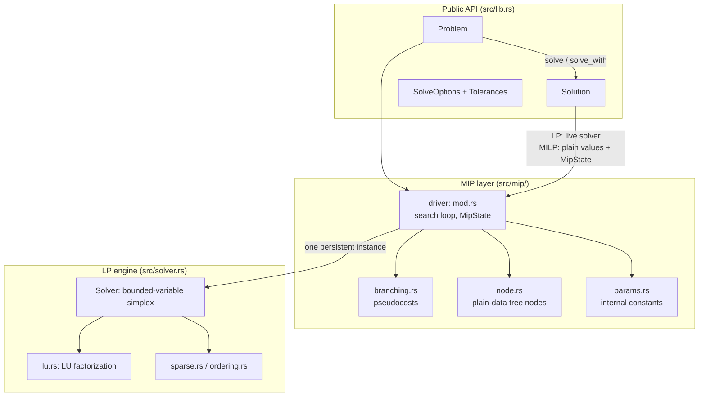
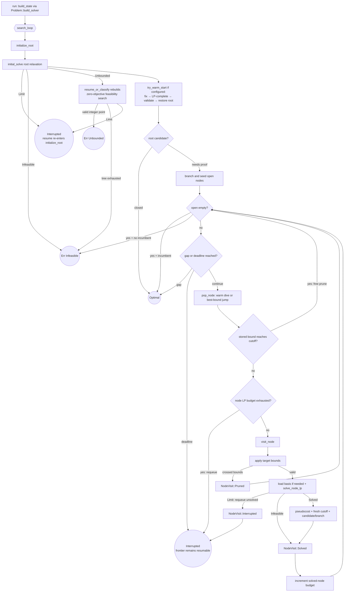
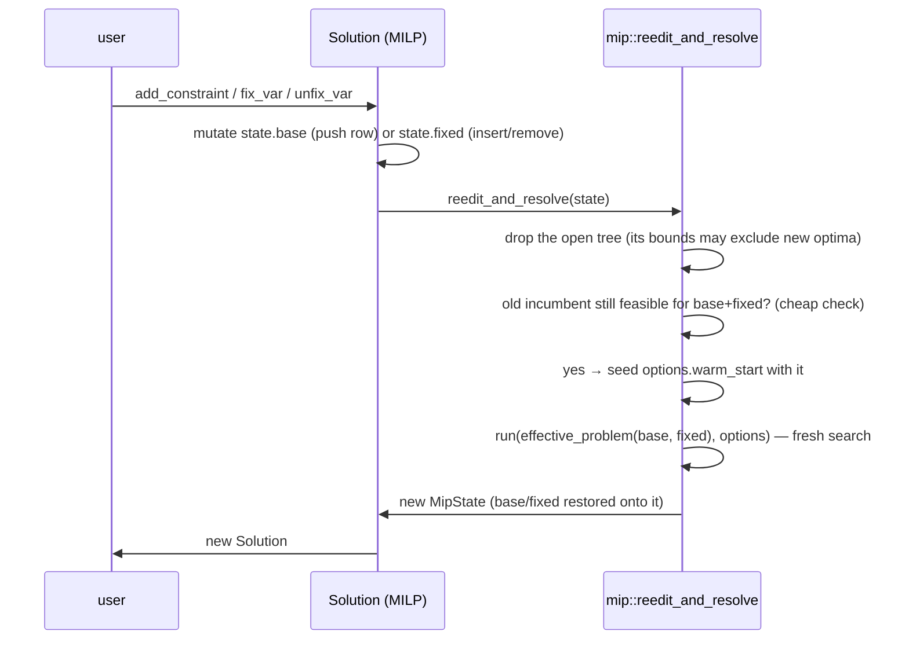

# microlp Architecture

This document explains how the solver works: how a problem flows from the public API
through the simplex engine and the branch & bound search, why the pieces are shaped the
way they are, and where to plug in improvements. It is written to be sufficient on its
own — a person (or an agent) who has read this should be able to navigate the codebase,
predict its behavior, and extend it safely.

---

## 1. The big picture

microlp solves **linear programs** (LP: continuous variables, linear constraints, linear
objective) and **mixed-integer linear programs** (MILP: same, but some variables must take
integer values). It is organized as two layers with a deliberately narrow interface between
them:



Three principles shape everything:

1. **One persistent LP solver per search.** The branch & bound tree never clones the solver
   and never grows the LP. Branching is expressed purely as *variable bound changes* on the
   single `Solver` instance, and tree nodes are plain data that describe how to reconstruct
   a state on that instance.
2. **No unfinished node LP is consulted.** A deadline is observed between completed simplex
   pivots and may stop a solve before optimality. The driver pushes that node back
   **unsolved** and makes no bound, candidate, or branch decision from the unfinished state.
   The next visit rebuilds the node from its own data. Node budgets and global search
   decisions are applied between node LP solves.
3. **Loud failures over silent wrong answers.** Child-LP errors are never conflated with
   infeasibility; numerical failures either recover through a documented valve or propagate
   as errors; candidate solutions are re-validated before being accepted. Where the code
   cannot do something properly it panics with a message rather than approximating.

### Module map

| File | Responsibility |
|---|---|
| `src/lib.rs` | Public API: `Problem`, `Solution`, `Status`, re-exports of `SolveOptions`/`Tolerances`/`Stats`. Owns solve/edit timing and the `Problem::build_solver` model-to-engine seam. |
| `src/solver.rs` | The simplex engine (`Solver`): bounded-variable primal/dual simplex, shared row preparation, basis management, and the small contract surface the MIP layer uses. |
| `src/lu.rs`, `src/sparse.rs`, `src/ordering.rs` | LU factorization with eta-file updates, sparse containers, fill-reducing ordering. |
| `src/mip/mod.rs` | The branch & bound driver: `MipState`, root initialization, single-node visits, outer search policy, interruption/resume, candidates, warm starts, edits, and bound/gap accounting. |
| `src/mip/node.rs` | `Node` (plain-data tree node) and `effective_bounds` (bound-change collapsing). |
| `src/mip/branching.rs` | Integrality checks and branch-variable selection (pseudocosts). |
| `src/mip/params.rs` | Named, documented internal constants (see §7). |
| `src/mps.rs` | MPS-format reader for the public API. |
| `tests/suite/` | The problem-based correctness suite (see §9) — the safety net for all of this. |

---

## 2. Problem representation

`Problem` stores the model in original user terms: objective coefficients, per-variable
bounds and domains (`Real`, `Integer`, `Boolean`), and constraint rows.

Two normalizations happen at the boundary and hold everywhere inside:

- **Internal objective space is always MINIMIZE.** `Maximize` problems negate their
  objective coefficients at variable-creation time (`internal_add_var`), and the sign is
  flipped back exactly once per read (`Solution::objective`, user-facing `Stats.best_bound`).
  Everything inside the driver — incumbents, bounds, pruning, gaps — is minimize-space.
  When editing driver code, never reason about direction; it does not exist there.
- **Every constraint row gets a slack variable.** A row `a·x ≤ b` becomes `a·x + s = b`
  with `s ∈ [0, +∞)`; `≥` gives `s ∈ (−∞, 0]`; `=` gives `s ∈ [0,0]`. So the `Solver`'s
  variable universe is `num_vars` *structural* variables followed by one slack per row
  ("total vars"), and every constraint is an equality against the basis matrix. A row's
  original sense is recoverable from its slack's bounds — `Solver::check_constraints`
  exploits exactly this.
- **Rows are equilibrated by powers of two.** Before the simplex engine sees a model, each
  non-empty row is multiplied by an exact power-of-two factor that brings its largest
  structural coefficient near one. This prevents equivalent rows at `1e-6` and `1e6` scales
  from producing structurally necessary tableau coefficients below the absolute pivot
  threshold, which would otherwise mis-declare a feasible model infeasible.
  `Solver::check_constraints` multiplies the caller's absolute feasibility tolerance by the
  same per-row factor, so the user-space acceptance contract is unchanged. Pure-LP and MIP
  models are equilibrated alike (the exactness of power-of-two scaling means the reported
  optimum is unaffected; only internal conditioning improves).

`prepare_row` is the single row-normalization contract used by both `Solver::try_new` and
incremental `Solver::add_constraint`. It classifies empty rows, computes the power-of-two
scale, scales coefficients and the right-hand side together, and derives slack bounds.
The two callers still own their genuinely different work: initial matrix/basis construction
versus extending a live matrix and repairing the current basis.

---

## 3. The LP engine (`src/solver.rs`)

The simplex core is the minilp lineage: a **bounded-variable
revised simplex** with both primal and dual iterations, steepest-edge pricing, the Harris
two-pass ratio test for numerical stability, and an LU-factorized basis updated by eta
matrices (refactorized when the eta file outgrows the factors).

State you need to know when reading it:

- `basic_vars[row]` — which variable is basic in each row; `basic_var_vals` their values.
- `nb_vars[col]` / `nb_var_vals` / `nb_var_states{at_min, at_max}` — non-basic variables
  sit at one of their bounds (or at 0 if free).
- `is_primal_feasible` / `is_dual_feasible` — honest flags; every solve path is a state
  machine over them. `initial_solve` = restore primal feasibility (dual simplex /
  phase-1-style) then optimize (primal simplex).
- `cur_obj_val`, `nb_var_obj_coeffs` (reduced costs), `lp_iterations` (cumulative pivot
  counter for stats).

### 3.1 The contract surface the MIP layer relies on

The engine exposes a small contract surface; everything the B&B does goes through these.

**`set_var_bounds(var, min, max) -> Result<(), Error>`** — change a variable's bounds in
place. Basic variable: update the row's bound mirrors, flag primal-infeasible if its value
fell outside. Non-basic variable: clamp its value to the new range, propagate the delta into
the basic values through the variable's column (same mechanism as `fix_var`), recompute its
at-bound flags, and downgrade `is_dual_feasible` if the move broke the reduced-cost/bound
pairing. Crossing bounds (`min > max`) or either bound being NaN returns
`Err(Infeasible)` with state untouched. Infinite bounds remain valid. It does **not** run
simplex — callers decide when to reoptimize.

*Why this is the branching primitive:* tightening a bound leaves every reduced cost
untouched, so the current basis stays **dual feasible** — re-solving is a short dual-simplex
run warm-started from the parent's optimal basis, typically a handful of pivots. This is the
single biggest performance lever in the design (see §10).

**`reoptimize() -> Result<StopReason, Error>`** — the re-solve entry: dual simplex if primal
feasibility is broken, then (only if needed, e.g. after loosening bounds or a basis load
with drift) recompute reduced costs and run primal simplex. Returns `StopReason::Limit` if
the deadline fires mid-run — leaving the honest feasibility flags so a later call continues
where it left off.

**`snapshot_basis() / load_basis(&Basis)`** — a `Basis` is one status per total variable:
`Basic | AtLower | AtUpper | Free` (~1 byte each). That is the *entire* warm-start state a
tree node needs. `load_basis` rebuilds everything from statuses + **current** bounds:
non-basic values from their status's bound, basic values and reduced costs recomputed from
scratch, LU refactorized, feasibility flags recomputed honestly. Two contracts matter:

- *Statuses are interpreted against the current bounds.* A status pointing at a bound that
  has since moved is remapped (nearest finite bound, else 0) rather than rejected — B&B
  jumps load a parent basis **after** applying different bounds, so this is load-bearing
  by design, not sloppiness.
- *On `Err`, solver state is unspecified* and must be restored by a subsequent successful
  load. `slack_basis()` (all slacks basic = identity basis matrix) always loads successfully
  and is the designated recovery everywhere.

**`check_constraints(values, tol)` / `objective_of(values)`** — evaluate an explicit
structural-variable vector against the stored, scaled rows (sense recovered from slack
bounds) within the correspondingly scaled **absolute** tolerance, and compute its objective.
Non-finite row activity is infeasible. These exist for the rounded-incumbent guard (§5.4)
and are deliberately independent of the current basis values.

---

## 4. The MIP data model (`src/mip/node.rs`, `MipState`)

```rust
// A tree node is PLAIN DATA — no solver machinery anywhere:
Node {
    bound_changes: Vec<(var, lo, hi)>, // cumulative from the root; later entries win
    basis: Basis,                      // the PARENT's optimal basis (warm start)
    lp_bound: f64,                     // parent's LP objective = valid lower bound here
    depth, parent_id,                  // parent_id detects warm dives (§5.2)
    branch_var: Option<usize>,         // None for the root, Some(var) for children
    branch_up, branch_frac             // metadata feeding pseudocost updates (§5.6)
}
```

Reconstructing any node's starting state = apply its `bound_changes` on top of the root
bounds, load its `basis`, reoptimize. That is the whole trick: because nodes carry no live
state, they are trivially storable, resumable, and cheap (a basis is `total_vars` bytes; a
bound-change list is `depth` entries).

The optional branch variable is a correctness distinction: the root has no creating branch
and therefore must never record a pseudocost observation. Every child stores the variable
and direction that created it.

`MipState` is the complete, resumable search:

| Field | Role |
|---|---|
| `solver` | the ONE live LP engine |
| `root_bounds`, `applied` | original bounds + which changes are currently applied to the solver (for diffing when switching nodes) |
| `open: Vec<Node>` | the frontier (LIFO tail = current dive; best-bound scan on jumps) |
| `incumbent: Option<Incumbent>` | best integer solution: **rounded** values + `objective = c·x_rounded` |
| `node_seq`, `last_solved_id`, `diving` | warm-dive detection + node-selection mode |
| `pseudocosts`, `stats`, `options`, `deadline`, `direction` | search intelligence and bookkeeping |
| `base: Problem`, `fixed: BTreeMap<var, val>` | the CLEAN user problem + user-level fixes — the substrate for post-solve edits (§5.8) |

`Solution` for a MILP holds `Status` + this `MipState` boxed. When an incumbent exists,
user reads come from its plain rounded values. An `Interrupted` solve without an incumbent
instead exposes the live solver's current working point for inspection. For a pure LP,
`Solution` keeps the live solver (that is what makes LP incremental editing cheap).

---

## 5. The branch & bound search (`src/mip/mod.rs`)

### 5.1 Lifecycle



### 5.2 Visiting a node: warm dives vs jumps

When a node is popped, its target bounds are diffed against `applied`: variables no longer
constrained are reset to root bounds, changed ones are set. Then one question decides the
cost of the visit: **is the solver already sitting at this node's parent's optimum?**

- `last_solved_id == node.parent_id` → **warm dive**: the parent was the immediately
  previously solved node, its basis is live in the solver, and the child differs by exactly
  one tightened bound. Skip the basis load entirely; `reoptimize` is a short dual-simplex
  run. This is the common case while diving.
- Otherwise → **jump**: load the node's stored parent basis (one refactorization), then
  reoptimize. `last_solved_id` is cleared on every path where the solver moves away from a
  just-solved optimum (prune-after-solve, infeasible, requeue, incumbent adoption), so the
  warm-dive check can never false-positive: ids are unique per branching.

### 5.3 Node LP solving and the robustness valves

`solve_node_lp` wraps `reoptimize` and owns error discrimination:

- `Err(Infeasible)` → genuinely infeasible node → prune. Correct and cheap.
- `Err(Unbounded)` → impossible for a bounded node → surfaced as `InternalError`.
- Any other error, such as a singular LU from numerical degradation → **retry once from
  the slack basis** (identity, cannot fail to load),
  re-solving the node from scratch; a second failure propagates. The retry is per-node-visit
  — it cannot mask a systematic failure.
- `Ok(Limit)` → the deadline fired mid-solve → the node is pushed back **unsolved** and the
  search returns `Interrupted`. Nothing uses the coherent but non-optimal state as a solved
  node: the next visit starts from its own bounds + basis data.

One more valve lives inside the engine itself, in `restore_feasibility` (the dual phase-1):
"no eligible entering column for a violated row" proves infeasibility only in exact
arithmetic. Deep in an eta-file chain, accumulated round-off can promote a phantom bound
violation into a leaving row whose (equally drifted) pivot row blocks every candidate — a
*false* `Infeasible`. Before an infeasibility declaration can stand, the engine refactorizes
the basis, recomputes basic values from the original data, and re-examines the row: a
phantom violation dissolves, while a real infeasibility survives. The valve is armed once
per stall and any successful pivot re-arms it, so it cannot loop. `EPS` remains tight
because the big-M correctness models require basic integer values to resolve sharply onto
their bounds (see the `EPS` docs in `solver.rs`).

### 5.4 Incumbents and the rounded-feasibility guard

When a node's LP solution is integral within `int_tol` (default `1e-6`), it is a *candidate*
— not yet an incumbent. Every solver-produced candidate enters `try_adopt_incumbent`, which
rounds integer variables and applies one validation funnel:

1. `candidate_variables_feasible` rejects malformed lengths, non-finite values, invalid
   bounds, bound violations, and domain violations.
2. `Solver::check_constraints` validates the vector against the active solver's scaled rows
   using the correspondingly scaled absolute `Tolerances::feasibility` (default `1e-7`).
3. `objective_of` must produce a finite objective before the incumbent can change.

Post-edit warm-start filtering deliberately remains separate: `incumbent_feasible` checks
the clean `Problem` plus its fix overlay in original user scale before a solver exists. Both
paths share variable/domain validation, but their row representations are not conflated.

Why this exists — the **big-M trap**: with `int_tol = 1e-6`, a relaxation value like
`b = 0.999999995` counts as integral. But if `b` multiplies a coefficient of `1e9` somewhere,
rounding it to `1` moves that row by `5.0` — a real violation hiding inside the integrality
tolerance. The guard makes this impossible to adopt:

- Guard **passes** → adopt: store the ROUNDED values with `objective = c·x_rounded`, so what
  the user reads is exactly self-consistent. If rounding changed any integer value, adoption
  does **not** close the node: the relaxation bound can still be strictly better than the
  rounded objective, so the driver branches on that below-tolerance fractionality to finish
  the proof.
- Guard **fails** → do not adopt; **branch on the offending below-tolerance variable**
  (children `⌊v⌋` / `⌊v⌋+1` fix it exactly, and the dive resolves the truth).
- Degenerate fallback: if every integer variable is *exactly* integral yet the check failed,
  retry once from the all-slack basis. This removes eta-chain drift on big-M rows; if the
  independently checked point is still invalid, return an internal error rather than
  force-accepting a potentially infeasible answer.

During zero-objective unboundedness classification, the same funnel runs first; only a valid
integer point returns `Err(Unbounded)`. If classification is interrupted before an incumbent
exists, the public objective is evaluated from the original model coefficients and the
current working values rather than from the temporary zero objective.

The tolerance is deliberately **absolute**, never scaled by row magnitude: a relative
tolerance (`1e-7·|rhs|`) evaluates to ~100 on a 1e9-scale row and would swallow exactly the
violations the guard exists to catch. A false *rejection* from the absolute check is benign
(extra exact-fixing branching); a false acceptance would be a wrong answer.

### 5.5 Node selection, bound, and gap

- **Plunging DFS with best-bound jumps** (`pop_node`): while the last processed node
  produced children (`diving == true`), pop LIFO — cheap warm dives, incumbents found fast.
  When a dive dies out (prune/infeasible/leaf), jump to the open node with the **lowest**
  `lp_bound` (linear scan, first-minimum tie-break, `swap_remove`).
- **Global dual bound** = min over open nodes' `lp_bound`, clamped by the incumbent
  (stale nodes may carry looser bounds than a fresher incumbent). Open list empty →
  the bound *is* the incumbent: proof complete. Valid only between nodes — a popped node's
  subtree is otherwise unaccounted.
- **Gap** = `(incumbent − bound) / max(|incumbent|, ε)` in minimize space (sign-free — the
  formula is direction-invariant). `mip_gap > 0` stops the search early with `Optimal`
  (proven within the requested gap); the default `0.0` demands exact proof and adds zero
  overhead (the check short-circuits).
- **Pruning** uses `cutoff(incumbent) = incumbent − max(ε, ε·|incumbent|)` with
  `ε = Tolerances::prune_epsilon` (default 1e-9), applied twice per node: against the stored
  parent bound *before* any LP work, and against the fresh objective after.

### 5.6 Pseudocost branching (`src/mip/branching.rs`)

The driver learns **pseudocosts**: per variable and direction, the average objective
degradation per unit of fractionality observed across solved child nodes.

- *Recording*: when a node with `branch_var = Some(var)` solves, its creating branch
  (`branch_up`, `branch_frac`) contributes
  `max(0, z_child − parent_bound) / branch_frac`. The root and every
  infeasible/interrupted node record nothing.
- *Selection*: maximize the product score
  `max(est_down·f_down, ε) · max(est_up·f_up, ε)` — variables whose BOTH directions hurt
  the relaxation are the ones worth deciding early. Before any observations exist, estimates
  fall back to `|objective coefficient| + ε` — with uniform coefficients this degrades
  gracefully to most-fractional.
- *Dive order*: of the two children, the one with the LOWER estimated degradation is pushed
  last (popped first) — dive toward the side more likely to stay feasible and good.

### 5.7 Warm starts

`SolveOptions::warm_start` accepts a (possibly partial) assignment. Evaluation happens once,
right after the root LP: fix the hinted variables to their (rounded, bounds-checked) values,
LP-complete the rest, and if the completion is integral, adopt it **through the same
feasibility guard as every other incumbent** — hints get no shortcut. Then restore the root
state *exactly* (bounds back, root basis reloaded, everything recomputed) so the search
starts from the true relaxation. Hints are advisory by design: unknown variables,
out-of-range values, infeasible or fractional completions all just drop the hint with a
debug log — a bad hint must never break a solve. An error discovered while evaluating the
hint is held until the temporary bounds and root basis have been restored, then propagated.

A warm start seeds the *incumbent*, which powers pruning; it does **not** carry the search
tree. Restarting the same model with an unchanged hint and the same deterministic node
budget repeats the same search prefix. Wall-clock cutoffs may vary, but still retain no
frontier. Consequently:

- To **continue** an interrupted solve of an unchanged problem: use `Solution::resume` —
  it keeps the open list and continues where it stopped, budget-for-budget.
- Restart-with-hint is the right tool when the problem **changed** (edits) or the state was
  lost. In a restart loop, once the carried hint stops improving, grow the budget so a later
  round can progress beyond the repeated search prefix (see
  `tests/suite/cases/warm_restart.rs`).

### 5.8 Post-solve edits

Applying post-solve edits to whatever internal state the search ended in — an incumbent
*leaf*, with branch bound-fixings still applied — would let feasible edits report
`Infeasible`. The edit model makes that impossible:



`base` is a clean copy of the user's problem that accumulates edits; `fixed` is the
`fix_var` overlay (so `unfix_var` can restore original bounds). Every edit re-solves the
*composed* problem from the root, warm-started by the surviving incumbent. Edits work on
paused (`Feasible`/`Interrupted`) solutions too — that is the "edit after a time limit"
feature. `unfix_var` returns `Result<(Solution, bool), Error>`; a prior interrupted edit can
leave `base+fixed` infeasible-unproven, and the unfix re-solve may be the one to prove it.

### 5.9 Interruption and resume, end to end

Timing is centralized without hiding the entry points' different policies:

- A pure LP's initial timer starts before `Problem::build_solver`, so construction and the
  initial simplex solve share one deadline. `Solution::resume` uses its explicitly supplied
  budget; LP edits use the original operation time limit. `timed_lp_call` always accumulates
  elapsed time, including calls that return an error.
- A MILP's initial run and each post-edit rebuild use its `SolveOptions`; `resume` installs
  the explicitly supplied fresh time budget on the retained search state. Paused MILPs are
  editable because edits discard the tree, while an interrupted pure LP must resume before
  its live basis can be edited safely.

MIP interruption points, in loop order, are: empty open list, gap target, deadline, then
node budget. Checking exhaustion first prevents a completed proof from being mislabeled as
interrupted. `node_limit` is per search call, so every `resume` receives a fresh node budget;
the retained frontier still supplies continuity between calls.

`Status` tells the truth about what you have:

| Status | Meaning | Accessors |
|---|---|---|
| `Optimal` | proof complete (within `mip_gap`) | all valid |
| `Feasible` | limit hit; incumbent exists; `gap()` quantifies it | all valid |
| `Interrupted` | limit hit before any usable solution | value accessors expose the **current working point** (possibly fractional/infeasible — checking the status is the caller's job); `resume()` continues |

A time limit is a *status*, never an `Error`. Solve failures use `Infeasible`, `Unbounded`,
or `InternalError`; public validation and state-machine misuse use `InvalidOptions` and
`InvalidOperation` respectively.

---

## 6. Public API tour

```rust
let mut problem = Problem::new(OptimizationDirection::Minimize);
let x = problem.add_integer_var(3.0, (0, 10));
let y = problem.add_var(4.0, (0.0, 10.0));
problem.add_constraint(&[(x, 1.0), (y, 2.0)], ComparisonOp::Ge, 5.0);

let mut options = SolveOptions::default();
options.time_limit = Some(Duration::from_secs(10));
options.node_limit = Some(100_000);          // deterministic alternative
options.mip_gap   = 0.01;                    // stop at a proven 1% gap
options.warm_start = Some(vec![(x, 2.0)]);   // advisory hint
options.tolerances.feasibility = 1e-7;       // expert knobs, see §7

let sol = problem.solve_with(options)?;
match sol.status() {
    Status::Optimal | Status::Feasible => {
        let _ = (sol.objective(), sol.var_value(x), sol.gap(), sol.stats());
        // continue searching, or edit and re-solve:
        let sol = sol.resume(Some(Duration::from_secs(10)))?;
        let sol = sol.add_constraint(&[(x, 1.0)], ComparisonOp::Le, 4.0)?;
        let (sol, was_fixed) = sol.fix_var(x, 3.0)?.unfix_var(x)?;
    }
    Status::Interrupted => { let _ = sol.resume(None)?; } // finish the job
}
```

Reading values: `var_value` rounds integer variables (and asserts the stored value was
already integral-clean — a failed assert means a solver bug, not user error);
`var_value_raw`/`iter`/indexing return the incumbent's already-rounded values for a MILP
with an incumbent, or the live working values for a pure LP and for an interrupted MILP
without an incumbent.

---

## 7. Numerical policy — every tolerance, in one place

Two homes, by audience:

**User-facing — `SolveOptions` (+ nested `Tolerances`):**

| Knob | Default | Gates |
|---|---|---|
| `int_tol` | `1e-6` | "is this LP value integral?" — a rounded feasible point may be adopted, but branching continues until its LP point is exact. Must be finite and in `[0, 0.5)`. |
| `mip_gap` | `0.0` | early-stop proof quality (relative gap) |
| `tolerances.feasibility` | `1e-7` **absolute** | the rounded-incumbent guard and the post-edit incumbent pre-filter (§5.4 explains why absolute) |
| `tolerances.integrality_rounding` | `1e-5` | integrality check in the edit pre-filter; `var_value`'s sanity assert pins the *default* deliberately |
| `tolerances.prune_epsilon` | `1e-9` | the pruning cutoff slack |

**Internal — `src/mip/params.rs` and `src/solver.rs` consts (each documented at its
definition):** `SCORE_EPS`, `PSEUDOCOST_INIT_EPS`, `BRANCH_FRAC_GUARD` (all `1e-6`),
`GAP_DENOM_GUARD` (`1e-10`), `HINT_BOUNDS_SLACK` (`1e-9`), `DEADLINE_CHECK_INTERVAL`
(`1000` pivots), `LU_STABILITY_THRESHOLD` (`0.1`), and the simplex pivot tolerance
`EPS` (`1e-10`) — the one number the whole engine's float comparisons are built on.

The layering rule: `EPS` decides *simplex* questions (is this coefficient zero, is this
value at its bound); `int_tol` decides *integrality* questions; `feasibility` decides
*solution acceptance*; `prune_epsilon` decides *tree* questions. They are close in
magnitude, but govern distinct layers and must not be conflated.

---

## 8. Error handling and robustness

| Situation | Behavior |
|---|---|
| Root LP unbounded on a MILP | run a resumable zero-objective integer-feasibility search; any integer point proves `Unbounded`, exhaustion proves `Infeasible` |
| Node LP infeasible | prune (correct) |
| Node LP unbounded | impossible when the node is bounded → `InternalError` |
| Singular LU or an exactly-integral candidate with guard-breaking drift | retry once from the slack basis; then propagate |
| `load_basis` failure on a jump | load the slack basis (infallible) and solve the node from scratch |
| Phase-1 stall (“no entering column”) | refresh the basis (fresh LU + recomputed values) and retry once per stall; declare `Infeasible` only if it survives the refresh |
| Deadline mid-LP | requeue the node unsolved; return `Interrupted` |
| Limit with no incumbent | `Status::Interrupted`; value accessors expose the current working point (inspection only) |
| Search exhausted, no incumbent | `Err(Infeasible)` |
| Warm-start hint invalid, out of range, infeasible, fractional, or limited | hint dropped (debug log), solve proceeds cold |
| Unexpected solver error while evaluating a warm start | restore root bounds and basis, then propagate the error |
| Edit makes the problem infeasible | `Err(Infeasible)` from the re-solve — on the *composed base problem*, never on leaf state |

The standing project policy: when something cannot be done properly, fail loudly
(`panic!`/`unreachable!` with a comment) rather than approximate — a solver's silent wrong
answer is strictly worse than its crash.

---

## 9. Testing strategy

Three rings, innermost first:

1. **Unit tests** in each module: the solver primitives (bound changes vs fresh solves,
   basis round-trips, slack-basis recovery), driver behaviors (optimum finding, infeasible
   detection, deterministic node-limit interruption/resume, exact-exhaustion status), and
   pseudocost/selection arithmetic. Several encode adversarially verified invariants
   (e.g. the warm-start liveness test *fails if the hint wiring is disconnected*).
2. **Public-API integration tests** (`src/tests/mip_api.rs`, `src/tests/resume.rs`):
   status semantics, panics, sign handling, edit composition, warm starts, sliced resumes
   equal unlimited solves value-for-value.
3. **The correctness suite** (`tests/suite`, `cargo test --release --test suite`) — a
   problem-based harness (parallel runner, ≤ 8 cores) where every answer is independently
   known: netlib/MIPLIB published optima, constructed instances, DP/brute-force oracles,
   plus a shadow model that re-validates every claimed solution (feasibility, integrality,
   objective consistency, and solver-soundness checks like "a feasible incumbent must never
   beat the proven optimum"). Cases are tiered **easy / medium / hard / xhard**; a tier
   flag is a cumulative upper limit (`-- --hard` runs easy + medium + hard). Easy + medium
   is the default run; CI runs the full hard tier with each case's supplied solve budget
   clamped to five minutes (`-- --hard --max-case-seconds 300`). This is cooperative for
   custom cases: their runner must pass the supplied budget into every solve.
   **xhard** (`-- --xhard`) holds the MILPBench
   families beyond the solver's current ceiling, on 10-minute budgets with externally
   certified (HiGHS) optima — those cases assert clean interrupts and bound sanity rather
   than completion. File-based cases derive their tier from the folder their instance
   lives in (`tests/suite/data/<tier>/<source>/`), so moving a file re-tiers its cases.
   Both benchmark readers are thin adapters over external dev-dependency crates —
   `mps` for MPS files, `lp_parser_rs` for CPLEX-LP files — with the semantics layer
   (integer markers, bound conventions, objective offsets) owned and documented in
   `tests/suite/mps_milp.rs` and `tests/suite/lp_format.rs`.
   The `milp/warm-restart-*` and `milp/nodelimit-steps-*` families exercise the
   restart-with-hint loop on real problems with monotone-improvement assertions.

If you change ANYTHING in the solver, the default suite tier is the first thing to run.

---

## 10. Performance characteristics and current limits

**What bound-change branching buys, structurally:** a row-based B&B adds a constraint row
per branch (matrix rebuild + LU refactorization + a new slack column at every node) and
stores solver clones per tree node. This design's per-node cost is: one bound change + a short
warm-started dual simplex (dive), or one basis refactorization (jump); per-node memory is a
basis snapshot + a bound list. Pseudocost branching uses observed child degradation to
shrink the tree while preserving the same node-state representation.

**Known, accepted costs:** the best-bound jump and the (only when `mip_gap > 0`) bound scan
are `O(open)` linear scans — fine at current scales, a heap if profiling ever says otherwise.
Basis snapshots per node are `total_vars` bytes; basis *aging* (snapshot every k-th depth)
is the standard next step if memory becomes a concern on deep trees.

**Where the ceiling currently sits** (measured, MILPBench easy tier at 60s/instance):
Capacitated Facility Location instances solve to proven optimality in seconds; the
graph-structured families (MIS, MVC, Set Cover, Combinatorial Auctions, MIKS) at 20k–60k
rows produce clean `Interrupted` — the machinery survives 160k-variable models without
error, but proving optimality there needs the phase-4 items below.

---

## 11. Extension points (rough order of payoff)

The current seams give presolve, node propagation, reduced-cost fixing, root cuts, and
incumbent dives a specific home:

- **Presolve and postsolve mapping.** `Problem::build_solver` is the single raw-model to
  simplex boundary. A presolver belongs immediately before it and must return both the
  transformed model and enough mapping data to reconstruct original variable values and
  objectives. Pure-LP incremental edits either need reductions that remain valid under the
  live edit API or a deliberate rebuild policy; they cannot silently reuse a stale mapping.
- **Node propagation.** Propagation belongs inside `visit_node`, after target bounds are
  applied and before `solve_node_lp`. Deduced bounds must be stored on the `Node` so children
  inherit them, and `state.applied` must mirror every partial tightening even when a
  contradiction prunes the node.
- **Reduced-cost fixing.** This belongs after a node LP solves and before candidate/branch
  inspection. Any bound change requires a reoptimization before integrality or branching
  reads the solver values.
- **Root cuts.** Root cut rounds belong in `initialize_root` before the first open node and
  its basis are snapshotted. Once the frontier exists, the row set must remain fixed because
  every stored basis is sized for it. Accepted cuts should use the same row-preparation
  contract as other solver rows.
- **Primal heuristics.** A bounded dive can run after a valid root or node LP. It must restore
  the search bounds/basis bookkeeping and submit a completed solver point through
  `try_adopt_incumbent(state)`; heuristic candidates receive no validation shortcut.
- **SOS1/SOS2.** Detection fits naturally in presolve. `Node.bound_changes` already supports
  multi-variable bound decisions, but propagation and basis bookkeeping must still obey the
  node-visit contracts above.
- **Basis aging / node memory**, **heap-based best-bound selection**, and an anti-cycling
  fallback remain independent engine/search-policy improvements; see §10.

---

## 12. Design boundaries

- Tree nodes remain plain data; live simplex machinery belongs only to `MipState::solver`.
- The open tree assumes a fixed solver row set. Any root transformation must finish before
  node bases are stored.
- Every solver-produced integer candidate goes through `try_adopt_incumbent`; user-scale
  prefilters do not replace active-solver row validation.
- `MipState::base` remains the clean user model. Search-only bounds, cuts, and transformed
  rows must not leak into the model used for public post-solve edits.
- Entry points own their time-budget policy; shared helpers may implement timing mechanics
  but must not make resume and edit budgets indistinguishable.
